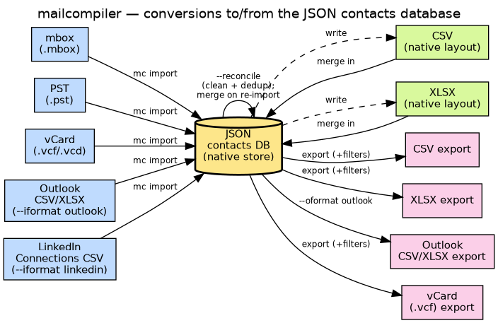

**MailCompiler** (`mc`) is a single-command CLI that lets you mine your mailboxes and address books (Gmail Takeout, Outlook archives, vCard, LinkedIn) and consolidate all of the data into a single, unified, de-duplicated, human-readable JSON contact database that you control.

> Own your inbox. Own your network.



## Motivation
- Your contact network is valuable, don't lose touch!
- Don't let platforms control you, own your data!
- Email client search functions are basically useless, we need a LLM friendly DB.
- Manually scraping old email inboxes to recover contacts is a waste of life.

## Key features
- Clean, human-readable JSON contact database
- Fast import from Gmail Takeout `.mbox` and Outlook `.pst` (handles 20 GB+)
- Import/export support for vCard 3.0 and CSV (Outlook) contact lists
- Lossless import/export between xlsx/csv files and the JSON database
- Streaming `.mbox` into an LLM-friendly JSON corpus
- Automatic extraction of email conversations into contacts
- Optional, opt-in phone-number mining from email signatures (`--discover-phones`)
- Incremental, non-destructive merging into a JSON database
- Deduplication and reconciliation of records
- Automatic industry categorization from a built-in [yellowpages directory](mailcompiler/yellowpages.csv)
- Blacklist support for email domains
- Automatic filtering of bot-farm email addresses
- Record filtering on export

## TL;DR

There's one command, `mc`, and one lossless read/write JSON database.

```bash
pip install -e .                           # install the `mc` command
export MC_DB=~/contacts.json               # set database location
mc -i takeout.mbox                         # import mbox contacts
mc -i connections.csv --iformat linkedin   # merge in linkedin connections
mc --reconcile                             # clean + merge duplicates
mc -o profit.xlsx                          # export to excel
```

## Installation

```bash
python -m venv .venv
source .venv/bin/activate
pip install -e .
```

## Examples

Build the JSON contacts database from a Gmail Takeout mbox and stash in $MC_DB:

    mc -i "All mail Including Spam and Trash.mbox"

Direct extraction from a Takeout mbox to an xlsx spreadsheet with an explicit output location:

    mc -i "All mail Including Spam and Trash.mbox" -o data/contacts.xlsx

Import an Outlook PST and stash in $MC_DB:

    mc -i archive.pst

Convert the JSON contacts in $MC_DB to an Excel spreadsheet:

    mc -o contacts.xlsx

Import a vCard export (Google Contacts / Gmail) and store in explicit location:

    mc -i contacts.vcf -o data/contacts.json

Import an Outlook / Google Contacts CSV export (`--iformat outlook`):

    mc -i contacts.csv --iformat outlook -o data/contacts.json

Enrich the DB from a LinkedIn Connections export (`--iformat linkedin`):
overwrites company/title (LinkedIn is the authority on current employer), adds
the profile URL, adds new connections, and stamps `import_date`:

    mc -i Connections.csv --iformat linkedin -o data/contacts.json

Imports always fold into the existing `-o` DB (they never wipe it); manual edits
are preserved unless you pass `--force` to overwrite overlapping fields:

    mc -i archive.pst -o data/contacts.json           # adds to the existing DB
    mc -i archive.pst -o data/contacts.json --force   # let the import win on conflicts

Exclude whole domains while importing:

    mc -i archive.pst -o data/contacts.json --blacklist blacklist.txt

Dump a per-email JSONL corpus for an LLM (no contacts DB):

    mc -i mailbox.mbox -o emails.jsonl --llm

Export filtered contacts to a vCard:

    mc -i data/contacts.json --category "Semiconductor Devices,Defense" -o leads.vcf

Export filtered contacts to CSV:

    mc --company Intel,AMD --min-emails 5 -o intel_amd.csv

Export only contacts at target-company domains (`--whitelist`), or drop
unwanted domains (`--blacklist`); both read one domain per line and ignore
`#` comments and blank lines, and match subdomains too. Each flag takes a
**list of files** (unioned), so you can keep categories in separate files:

    mc --whitelist semiconductor.txt defense.txt -o targets.xlsx
    mc --blacklist spam_domains.txt competitors.txt -o cleaned.json

Export in Outlook's column layout, as CSV or XLSX (`--oformat outlook`):

    mc -o outlook.csv --oformat outlook
    mc -o outlook.xlsx --oformat outlook

Clean and merge duplicate records, rewriting in place:

    mc --reconcile

Merge one database into another (folding `extra.json` into `data/contacts.json`):

    mc -i extra.json -o data/contacts.json

### Set the database once with `$MC_DB`

So you don't repeat `-o contacts.json` on every command, point `$MC_DB` at your
database; a missing `-i` or `-o` then defaults to it (explicit flags still win):

```bash
export MC_DB=~/contacts.json     # in your shell rc
mc -i takeout.mbox               # -o defaults to $MC_DB (created if absent)
mc -i archive.pst                # fold another source in
mc --reconcile                   # -i and -o both default to $MC_DB
mc -o leads.xlsx                 # export: -i defaults to $MC_DB
```


## MC Help

```
usage: mc [-h] [-i INPUT] [-o OUTPUT]
          [--iformat {json,csv,xlsx,outlook,vcard,linkedin,mbox,pst,jsonl}]
          [--oformat {json,csv,xlsx,outlook,vcard,linkedin,mbox,pst,jsonl}]
          [--reconcile] [-v] [--force] [--self-phone LIST] [--discover-phones]
          [--llm] [--max-body BYTES] [--no-cc] [--whitelist PATH [PATH ...]]
          [--blacklist PATH [PATH ...]] [--category CATEGORY]
          [--company COMPANY] [--first-name FIRST_NAME]
          [--last-name LAST_NAME] [--email-domain EMAIL_DOMAIN]
          [--min-emails MIN_EMAILS] [--max-emails MAX_EMAILS]
          [--min-sent MIN_SENT] [--max-sent MAX_SENT]
          [--min-received MIN_RECEIVED] [--max-received MAX_RECEIVED]
          [--min-ranking MIN_RANKING] [--max-ranking MAX_RANKING]
          [--last-after YYYY-MM-DD] [--last-before YYYY-MM-DD]
          [--first-after YYYY-MM-DD] [--first-before YYYY-MM-DD]

mailcompiler: build and query a contacts database. The operation is inferred
from the -i/-o formats: a mailbox, vCard, Outlook CSV, or LinkedIn export
imports into a contacts DB; a JSON input exports (-o .csv/.vcf) or reconciles
(-o .json --reconcile). Imports and DB writes always fold into the existing -o
(never wiping it); pass --force to overwrite overlapping fields.

options:
  -h, --help            show this help message and exit
  -i INPUT, --input INPUT
                        input path: a mailbox (.mbox/.pst), a vCard
                        (.vcf/.vcd), an Outlook CSV (--iformat outlook), or a
                        contacts .json. Defaults to $MC_DB if set.
  -o OUTPUT, --output OUTPUT
                        output path: a .json contacts DB, a .csv/.vcf export,
                        or a .jsonl corpus (with --llm). Defaults to $MC_DB if
                        set.
  --iformat {json,csv,xlsx,outlook,vcard,linkedin,mbox,pst,jsonl}
                        force the input format instead of inferring it from
                        the extension; 'outlook' reads an Outlook/Google CSV
  --oformat {json,csv,xlsx,outlook,vcard,linkedin,mbox,pst,jsonl}
                        force the output format instead of inferring it from
                        the extension; 'outlook' writes Outlook's CSV layout
  --reconcile           clean and merge records (json -> json): drop junk/role
                        addresses, merge duplicates by email and by name,
                        recompute fields, and pick the best primary email
  -v, --verbose         print every discard/action to stderr: on import, each
                        skipped email and why (spam, trash, self, blacklisted,
                        automated, no-name); with --reconcile, every
                        drop/merge/field change
  --force               when an imported record overlaps an existing one,
                        overwrite the existing text fields (company, title,
                        name, ...) with the incoming values; by default
                        existing (hand-edited) values are kept
  --self-phone LIST     your own phone number(s) (comma-separated; also read
                        from $MC_SELF_PHONE) to never ingest as a contact's
                        number -- they leak into records via quoted signatures
  --discover-phones     (mailbox import; OFF by default) mine phone numbers
                        from the signature region of received mail -- the tail
                        of the body below a '-- ' marker / above the quoted
                        reply -- and credit the most-frequent number to the
                        sender. HEURISTIC AND ERROR-PRONE: a signature quoted
                        at the bottom of a reply thread is easily
                        misattributed, so ~15%+ of discovered numbers are
                        wrong (one number can spread across many contacts).
                        Structured imports (vCard/Outlook/LinkedIn) always
                        keep their phone fields regardless. Pair with --self-
                        phone; reconcile drops numbers shared across many
                        contacts.
  --llm                 dump a per-email JSONL corpus
                        (subject/from/to/date/body) from an mbox/PST instead
                        of building the DB
  --max-body BYTES      --llm: cap each message body to BYTES (default 262144;
                        0 = unlimited) so attachment blobs do not dominate
  --no-cc               when importing a mailbox, do NOT bring in the other
                        To/Cc recipients of mail you received; keep only
                        direct senders and the recipients of your sent mail
                        (less noise)
  --whitelist PATH [PATH ...]
                        keep only contacts whose email domain matches an entry
                        in these files (one domain per line; '#' comments and
                        blank lines ignored; subdomains match too). Accepts
                        multiple files (unioned) and may be repeated.
  --blacklist PATH [PATH ...]
                        drop contacts/addresses whose email domain matches an
                        entry in these files (one per line; '#' comments and
                        blank lines ignored; subdomains match too). Accepts
                        multiple files (unioned) and may be repeated.
  --category CATEGORY   match contact category (industry segment from the
                        yellowpages directory) against any of LIST
  --company COMPANY     match company against any of LIST
  --first-name FIRST_NAME
                        match first name against any of LIST
  --last-name LAST_NAME
                        match last name against any of LIST
  --email-domain EMAIL_DOMAIN
                        match primary email domain against any of LIST
  --min-emails MIN_EMAILS
                        minimum num_emails
  --max-emails MAX_EMAILS
                        maximum num_emails
  --min-sent MIN_SENT   minimum num_sent
  --max-sent MAX_SENT   maximum num_sent
  --min-received MIN_RECEIVED
                        minimum num_received
  --max-received MAX_RECEIVED
                        maximum num_received
  --min-ranking MIN_RANKING
                        minimum ranking (0-100)
  --max-ranking MAX_RANKING
                        maximum ranking (0-100)
  --last-after YYYY-MM-DD
                        last_interaction on or after this date
  --last-before YYYY-MM-DD
                        last_interaction on or before this date
  --first-after YYYY-MM-DD
                        first_interaction on or after this date
  --first-before YYYY-MM-DD
                        first_interaction on or before this date

```

## Database Record

The database is a JSON array of contact records. Each record has the same 24
fields, in this order:

```json
{
  "last_name": "Vale",
  "first_name": "Jordan",
  "friend": true,
  "title": "CTO",
  "company": "Globex",
  "category": "Semiconductor Devices",
  "primary_phone": "+16502530000",
  "phone_numbers": ["+16502530000", "+14155550000"],
  "address": "10 Loop, Springfield CA",
  "birthday": "1985-04-12",
  "primary_email": "jordan@globex.com",
  "emails": ["jordan@globex.com", "jordan.vale@globex.com"],
  "num_emails": 50,
  "num_sent": 30,
  "num_received": 20,
  "first_interaction": "2023-01-01",
  "last_interaction": "2025-03-15",
  "source": "work.mbox | takeout.mbox",
  "linkedin": "https://www.linkedin.com/in/jordanvale",
  "github": "https://github.com/jvale",
  "ranking": 75,
  "notes": "Met at the 2025 conference.",
  "import_date": "2026-06-06",
  "id": "11111111-1111-1111-1111-111111111111"
}
```

| Field | Type | Description |
| --- | --- | --- |
| `last_name` | string | Surname, derived from the display name. |
| `first_name` | string | Given name, derived from the display name. |
| `friend` | boolean | Annotation flag; set from a vCard `friend` category. On import the values `Y`/`1`/`true`/`yes` (case-insensitive) become `true`, everything else `false`. |
| `title` | string | Annotation you fill in (job title); set from a vCard `TITLE`, otherwise blank. |
| `company` | string | Derived from the email domain; blank for free providers (gmail/yahoo/outlook/...). |
| `category` | string | Industry segment (e.g. `Semiconductor Devices`, `Defense`, `Venture Capital`, `Academic`), set automatically from the bundled yellowpages directory by email domain during `--reconcile`. Blank on import and for unlisted domains. |
| `primary_phone` | string | The preferred phone number, normalized to `+E.164`; blank if none found. |
| `phone_numbers` | string[] | All known numbers, primary first. From vCard `TEL` / Outlook columns, or (only with `--discover-phones`) mined from mail signatures. |
| `address` | string | Annotation you fill in; set from a vCard `ADR`/`LABEL`, otherwise blank. |
| `birthday` | string | `YYYY-MM-DD`; annotation you fill in, or from a vCard `BDAY` / Outlook Birthday. Blank if unknown. |
| `primary_email` | string | The most-used address; the merge key. |
| `emails` | string[] | All known addresses for the person, primary first. |
| `num_emails` | integer | Total direct messages exchanged (`num_sent` + `num_received`). 0 for a contact you only shared a thread with. |
| `num_sent` | integer | Messages you sent to this contact. |
| `num_received` | integer | Messages received from this contact. |
| `first_interaction` | string\|null | Earliest interaction date (`YYYY-MM-DD`), or `null` if unknown. |
| `last_interaction` | string\|null | Latest interaction date (`YYYY-MM-DD`), or `null` if unknown. |
| `source` | string | Origin file(s) the record came from, joined by ` \| `. |
| `linkedin` | string | LinkedIn profile URL; set by a LinkedIn import (`--iformat linkedin`), otherwise blank. |
| `github` | string | GitHub profile URL/handle; annotation you fill in, or from a vCard `URL`. Blank otherwise. |
| `ranking` | integer | Hand-set importance score `0`–`100` (default `0`); filterable with `--min-ranking`/`--max-ranking`. Merges keep the higher value. |
| `notes` | string | Free-text annotation you fill in. Blank otherwise. |
| `import_date` | string | Date (`YYYY-MM-DD`) of the most recent non-database import (mbox/PST/vCard/Outlook/LinkedIn) that touched this record; blank for purely database-derived rows. |
| `id` | string | Stable per-record UUID, minted when the record is first created and preserved across merges. |

The annotation columns (`friend`, `title`, `address`, `birthday`, `github`,
`ranking`, `notes`) are left blank on a mailbox import for you to fill in by
hand; they are preserved across re-imports and merges (see
[Merging and `--force`](#merging-the-default-and---force)).
(`category` is set automatically by `--reconcile`, not hand-filled.) The same
fields are the columns of the CSV export, and map to the corresponding vCard
properties on export.


## Building the contacts database

An mbox/PST/vCard/Outlook-CSV input is treated as an **import**, building
contacts into the output database. A Gmail Takeout `.mbox`, an Outlook `.pst`,
and a vCard `.vcf`/`.vcd` are recognized by the `-i` extension. From a mailbox,
contacts are the people you have corresponded with (sent to or heard from), with
automated/bulk senders, spam, and nameless entries filtered out, identities
merged by display name, and company derived from the email domain.

```bash
mc -i "/path/to/Takeout/Mail/All mail Including Spam and Trash.mbox" -o data/contacts.json
mc -i "/path/to/archive.pst" -o data/contacts.json    # Outlook PST
mc -i "/path/to/contacts.vcf" -o data/contacts.json   # vCard (e.g. a Gmail export)
```

`-i` and `-o` each default to `$MC_DB` when omitted (see
[Set the database once with `$MC_DB`](#set-the-database-once-with-mc_db)). The
output format follows the `-o` extension:
`.json`, `.csv`, and `.xlsx` are the interchangeable native database formats
(same columns, lossless round-trip -- edit the DB in Excel and re-import it), and
`.vcf` writes a vCard. Excel support is `.xlsx` only (via openpyxl); the legacy
binary `.xls` is not supported. To read an **Outlook-format CSV/XLSX** (the
column layout Outlook and Google Contacts export) pass `--iformat outlook`, since
a bare `.csv`/`.xlsx` is read as the native layout:

    mc -i contacts.csv --iformat outlook -o data/contacts.json

The Outlook reader takes First/Last Name, Job Title, Company, the E-mail Address
columns, Business Phone, and the business address columns; `category`/`friend` and
email counts are left blank/0. See `mc -h` for all options.

Importing a **vCard** adds its contacts directly (no message filtering): it maps
N/FN, ORG, TITLE, TEL, ADR, every EMAIL, and `CATEGORIES` (the first non-`friend`
category becomes the contact's `category`; a `friend` category sets the friend
flag). Like any import it folds into the existing database, so you can combine a
vCard export with an mbox-built database.

### What gets imported

A row is created for each **person you have corresponded with** -- anyone you
sent mail to or who sent mail to you. Specifically, an address is imported only
if **all** of these hold:

- It appeared on a message with you: a recipient (`To`/`Cc`) of mail you sent
  (counts as `num_sent`), the sender (`From`) of mail you received (`num_received`),
  **or** one of the *other* `To`/`Cc` recipients of mail you received -- people on
  a thread with you, even if you never corresponded directly (these count 0
  sent/received). For PST, "sent" mail is the **Sent Items** folder. Including
  thread co-recipients gives broad reach but is noisier -- large CC lists,
  mailing lists -- which the bot/no-reply/blacklist filters below help trim;
  pass **`--no-cc`** to skip them entirely and keep only direct correspondents.
- The message is **not** spam: the Gmail `Spam` label, or for PST the **Junk
  Email** folder, is skipped.
- It is **not one of your own addresses** (auto-detected from the mbox
  `Delivered-To` header and the `From` of sent mail).
- It is **not an automated/bulk sender** -- e.g. `no-reply@`, `mailer-daemon`,
  `postmaster`, notifications, newsletters, marketing/unsubscribe addresses,
  `+`-tagged addresses (such as GitHub `reply+...`), or a bulk email-service /
  mailing-list domain (Mailchimp, SendGrid, Marketo, Beehiiv, GitHub, ...).
- Its domain is **not in `--blacklist`** (see below).
- The resulting contact has **both a first and last name** (single-name or
  org-style entries are dropped).

Then, across all imported addresses:

- Multiple addresses for the **same person** (matching display name) are merged
  into one row; the most-used address becomes the primary email.
- `phone_numbers` are **not** mined from mail by default. With **`--discover-phones`**
  (opt-in) they are pulled from the contact's **email signature** in mail they
  sent you (the signature region only -- bottom of the message / labeled lines),
  validated and normalized to `+E.164` via
  [phonenumbers](https://github.com/daviddrysdale/python-phonenumbers) (numbers
  written without a country code are assumed US); the most-frequently-seen
  number becomes `primary_phone`. This is **heuristic and error-prone** (~15%+
  of mined numbers are misattributed, e.g. a quoted signature credited to the
  wrong person), so it is off by default. Pass `--self-phone` to exclude your
  own number, and note that `--reconcile` drops any number shared across many
  contacts. Phones from vCard/Outlook/LinkedIn imports are always kept.
- `company` is derived from the email domain (blank for free providers like
  gmail/yahoo/outlook), and each row records sent/received counts, the first and
  last interaction dates, and the `source` filename (the `.mbox`/`.pst` it came
  from).

Pass `--blacklist PATH` to exclude whole domains from the contacts. The file
lists one domain per line (`#` comments and blank lines ignored); entries may be
written as `example.com` or `@example.com`, and subdomains are matched too:

```text
# blacklist.txt
recruiting-spam.com
@newsletters.example.org
```

`--whitelist PATH` is the inverse, used on **export**: it keeps only contacts
whose email domain (the `primary_email` or any address in `emails`) matches an
entry in the file, dropping everyone else. It uses the same file format as
`--blacklist` (one domain per line, `#` comments and blank lines ignored,
subdomains matched), so a categorized list with `# section` headers works as-is:

```text
# companies.txt
# -- semiconductor --
intel.com
nvidia.com
# -- agencies --
darpa.mil
```

`--whitelist` and `--blacklist` can be combined and apply to any export
(`-o .csv/.xlsx/.vcf/.json`); whitelist keeps matches, blacklist then removes
any that should still be dropped.

### Merging (the default) and `--force`

An import (and a DB&nbsp;->&nbsp;`.json` write) **always folds into the existing
output DB -- it never wipes it.** A missing output file is created fresh; an
existing one is read, merged into, and written back. There is no separate
"overwrite the whole file" mode: to start over, delete the file (or point `-o` at
a new path).

For an existing contact, the counts (`num_emails`, `num_sent`, `num_received`)
are overwritten with the latest import, the email list is unioned, the
interaction date range widens, and `import_date` updates. Hand-edited text fields
(`friend`/`title`/`address`, plus name/company/phone) are **preserved** by
default -- the import only fills a blank. Pass **`--force`** to let the incoming
non-empty values **overwrite** those fields instead. Contacts present only in the
old file are always kept.

```bash
mc -i archive.pst -o data/contacts.json            # fold in; keep manual edits
mc -i archive.pst -o data/contacts.json --force    # let the import win on conflicts
mc -i extra.json  -o data/contacts.json            # fold one DB into another
```

This lets you re-run as a mailbox grows, or accumulate multiple sources, without
losing manual annotations. Imported rows include blank columns for you to fill in
by hand: `friend`, `title`, and `address`. (The `category` column -- an industry
segment -- is filled automatically by `--reconcile` from the bundled yellowpages
directory.)

(Records are matched by email, or by LinkedIn profile URL when there is no email,
so email-less LinkedIn contacts survive a merge.)

### Importing from LinkedIn

A LinkedIn **Connections** export (`Settings -> Data privacy -> Get a copy of
your data -> Connections`) is the authority on a contact's *current* employer and
title. Import it with `--iformat linkedin` (the `.csv` extension alone is
ambiguous, so the format is explicit, like `outlook`); it folds into your existing
DB:

```bash
mc -i Connections.csv --iformat linkedin -o data/contacts.json
```

How it differs from a normal merge:

- **Matching:** by profile **URL**, then **email**, then normalized **first+last
  name** (LinkedIn omits most emails, so names do most of the work). A name that
  matches more than one existing contact is **skipped** (reported), not guessed.
- **Authority:** on a match, `company` and `title` are **overwritten** from
  LinkedIn (a normal merge would preserve them). The profile URL is stored in
  `linkedin`.
- **New connections are added** as contacts (most have no email -- they are
  identified by their LinkedIn URL). A connection with neither an email nor a URL
  is skipped (nothing to key it by).
- **`import_date`** is set to the date you run `mc` (use it later to reason about
  how fresh a contact's company is). It is stamped on every non-database import
  (mbox, PST, vCard, Outlook, LinkedIn), and left blank for database-only rows.

Re-running the same export is idempotent (URL/email matches refresh in place
rather than duplicating).

### Dump for an LLM

`--llm` skips the contacts database and instead writes a per-email **JSONL**
corpus (one JSON object per line) for feeding to an LLM. Each record is
`{subject, from, to, date, body}` with the full body, HTML stripped to text.
Every message is included except obvious `no-reply` senders, and it works on both
mbox and PST.

```bash
mc -i mailbox.mbox -o emails.jsonl --llm
mc -i archive.pst  -o emails.jsonl --llm    # works on PST too
```

The JSONL is streamed as messages are read, so it scales to very large mailboxes
without holding everything in memory.

## Exporting contacts

Giving a **JSON database** as `-i` with a `.csv`/`.vcf` output runs an
**export**: it selects a subset of contacts by per-column criteria and writes
the **whole record** for each match. The output format follows the `-o`
extension:

- **`.csv`** -- all database columns. Pass `--oformat outlook` to instead write
  Outlook's CSV column layout (`First Name`, `E-mail Address`, `Business Phone`,
  ...) that Outlook and Google Contacts import directly.
- **`.vcf`** -- a Gmail-compatible **vCard 3.0** file (importable into Google
  Contacts and Outlook), CRLF-delimited and line-folded to 75 octets.

Text filters take comma-separated lists (case-insensitive, match any); numeric
and date filters are inclusive ranges; all filters combine with AND. Note that
`--company` matches the derived company *name* (e.g. `Globex`), while
`--email-domain` matches the address domain (e.g. `globex.com`).

For a long list of domains, use `--whitelist FILE...` (keep only matches) and/or
`--blacklist FILE...` (drop matches) instead of a comma-separated `--email-domain`.
Unlike `--email-domain`, these read files (`#` comments and blank lines
ignored), match **any** of a contact's addresses (`primary_email` plus
`emails`), and match **subdomains** too (`intel.com` also catches
`fab.intel.com`). Each flag accepts **multiple files** (their domains are
unioned, and the flag may also be repeated), so you can keep each category in
its own file. They combine with each other and with all the column filters.

```bash
# All semiconductor and defense contacts (category set by --reconcile) -> vCard:
mc -i data/contacts.json --category "Semiconductor Devices,Defense" -o leads.vcf

# Everyone at Intel or AMD with at least 5 emails, active since 2024 -> CSV:
mc -i data/contacts.json \
  --company Intel,AMD --min-emails 5 --last-after 2024-01-01 -o intel_amd.csv

# All intel.com contacts since 2025 -> vCard:
mc -i data/contacts.json \
  --email-domain intel.com --last-after 2025-01-01 -o intel.vcf

# Only contacts at target-company domains, split across category files -> XLSX:
mc -i data/contacts.json \
  --whitelist semiconductor.txt defense.txt equipment.txt -o targets.xlsx
```

The vCard maps name/emails (primary marked `PREF`), `company`->ORG,
`title`->TITLE, `phone_numbers`->TEL (primary marked `PREF`), `birthday`->BDAY,
`github`->URL, `address`->ADR/LABEL, and `category`/`friend`->CATEGORIES, plus a
NOTE with the email counts, last-contact date, and `notes`.

`--category` matches the industry segment assigned by `--reconcile` (e.g.
`Semiconductor Devices`, `Defense`, `Venture Capital`, `Academic`). See `mc -h`
for the full set of filters (`--category`, `--first-name`, `--last-name`,
`--email-domain`, `--whitelist`, `--blacklist`, `--min/max-emails`,
`--min/max-sent`, `--min/max-received`, `--first-after/before`,
`--last-after/before`).

## Reconciling contacts

After building a database from several sources (mbox, PST, vCard, Outlook,
LinkedIn), `--reconcile` is a one-step cleanup pass over the JSON DB that merges
duplicates (by both name and email) and tidies records:

```bash
mc --reconcile -i contacts.json -o contacts.json   # clean + merge, in place
```

In order, reconcile:

1. **Drops junk addresses** -- invalid emails, automated/bot senders, and
   role/generic mailboxes (`no-reply@`, `info@`, `sales@`, ...).
2. **Merges duplicates by shared email** -- the same person under two display
   names who share an address (e.g. `Bob Jones` and `Robert Jones`, both at
   `bob@acme.com`) that a name match misses. Free-provider (gmail/...), role, and
   bot addresses are **not** used as merge keys, so people who merely share a
   common mailbox are not fused.
3. **Merges duplicates by name** (same first+last, case-insensitive).
4. **Recomputes** `num_emails`, lowercases/dedupes `emails`, and fills a blank
   `company` from the primary domain.
5. **Picks the best primary email** -- the address whose domain matches the
   contact's current `company` if there is one, else the most-used address.
6. **Normalizes** name capitalization and phone numbers (to `+E.164`).
7. **Standardizes companies and assigns `category`** from the bundled
   yellowpages directory, keyed by email domain: company-name spelling variants
   are collapsed to one form, and listed domains get an authoritative company
   name plus an industry `category` (e.g. `Semiconductor Devices`, `Defense`); a
   `.edu` address gets `Academic`. Unlisted domains keep their company and a
   blank category.

When duplicates are merged, `company`/`title` come from the **LinkedIn-sourced**
record (LinkedIn is the authority on current employer); all other fields come
from the record with the **newest `last_interaction`**. Counts sum, emails and
sources union, dates widen. A record left with no email, LinkedIn URL, **or**
phone number is dropped. Reconcile is idempotent -- running it again changes
nothing.
